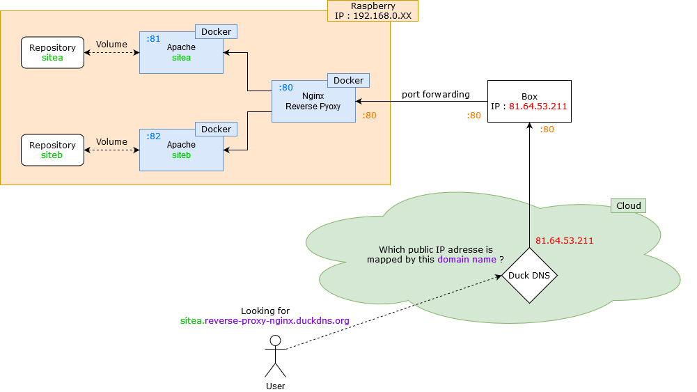

# Create a Nginx reverse proxy using Docker
In this project, we'll see how create a **Nginx reverse proxy** which redirect request **according to subdomain name input.**

## What am I using ?
- A **Raspberry Pi** as **host device.**
- **Apache**, web server **to host websites**
- **Nginx**, using for **reverse proxy**
- **Docker**, for **make development easier**
- **Duck DNS**, to create **domain name for free**

## How it works ?

1. User is looking for our website typing **`sitea.reverse-proxy-nginx.duckdns.org`**, for example.
2. This url is asking **Duck DNS** (by means of `duckdns.org`) from what **public IP** is mapped `reverse-proxy-nginx` domain name.
    > Here, public IP address is **`81.64.53.211`**.
3. **User request is send to public IP address**, our internet box, **on port 80**.
    > By default, web browsers using port 80.
4. By means of port forwarding internet box side, **request is forwarded to Nginx host machine.**
    > See **'Ports'** section.
5. **Nginx reads the header request and calls web server** related to `sitea` subdomain name.
6. **User can see resource asked for.**

## Ports
- Make a request by URL in a web browser uses port 80.
- We have to configure a **port forwarding between port 80** of our **internet box** and **port 80** of our **Nginx host device.**
    > Private IP address is required to identify our Nginx host device from our local network.
- **Each Apache container must run on a different ports** of our host device.
    > Ports 81 and port 82 in our case.
                                                                                >
## Get started
First of all create **two** `index.html` files **each of them into a folder.**
1. `/path/of/your/repository/sitea/index.html` :
    ```
    <html>
        <body>
            <h1>Site A</h1>
        </body>
    </html>
    ```
2. `/path/of/your/repository/siteb/index.html` :
    ```
    <html>
        <body>
            <h1>Site B</h1>
        </body>
    </html>
    ```
Then, initialize `default.conf`, the **Nginx configuration file** from `D:/path/of/your/repository/nginx` folder :
```
server_names_hash_bucket_size 64;

server {
    listen 80  default_server;
    server_name _;
    return 444;
}
```
*Now, it returns a **444 error** if subdomain name request does not match any `server name` below.*

Let's create our first root for our first subdomain name from `default.conf` file, add :
```
server {
	listen 80;
	server_name sitea.reverse-proxy-nginx.duckdns.org;
	
	location / {
		proxy_pass http://sitea_service;
	}
}

upstream sitea_service {
    server 192.168.0.XX:81;
}
```
> Replace `192.168.0.XX` by private IP address of your host device

Here, `sitea.reverse-proxy-nginx.duckdns.org` will looking for website hosted by **Apache** on **port 81** of our device

Make the same thing for our second subdomain name `siteb.reverse-proxy-nginx.duckdns.org` :
```
server {
	listen 80;
	server_name siteb.reverse-proxy-nginx.duckdns.org;
	
	location / {
		proxy_pass http://siteb_service;
	}
}

upstream siteb_service {
    server 192.168.0.XX:82;
}
```
> Replace `192.168.0.XX` by private IP address of your host device

Now, we are ready to looking for our **second web server** running on **port 82** of our host device.

To make it functional using **docker-compose**, create `docker-compose.yml` file :
```
version: '2'
services:
  sitea:
    image: httpd
    container_name: apache_site_a
    volumes:
      - /path/of/your/repository/sitea/index.html:/usr/local/apache2/htdocs/index.html
    ports:
      - "81:80"
      
  siteb:
    image: httpd
    container_name: apache_site_b
    volumes:
      - /path/of/your/repository/siteb/index.html:/usr/local/apache2/htdocs/index.html
    ports:
      - "82:80"
      
  nginx:
    image: nginx
    container_name: my_nginx
    volumes:
      - D:/path/of/your/repository/nginx/default.conf:/etc/nginx/conf.d/default.conf
    ports:
      - "80:80"
```
**Make sure you did port forwarding** from your internet box, **then run docker compose file** typing `docker-compose up -d`.

Now you can access to hosted websites from your web browser : `sitea.reverse-proxy-nginx.duckdns.org` and `siteb.reverse-proxy-nginx.duckdns.org`.

**Well done** ! :heavy_check_mark: